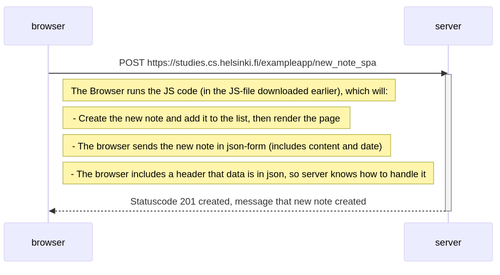

# Tehtävä 0.6: Single Page App, uusi muistiinpano

sequenceDiagram

    participant browser
    participant server
    
    browser->>server: POST https://studies.cs.helsinki.fi/exampleapp/new_note_spa
    activate server
    Note right of browser: The Browser runs the JS code (in the JS-file downloaded earlier), which will:
    Note right of browser: - Create the new note and add it to the list, then render the page 
    Note right of browser: - The browser sends the new note in json-form (includes content and date)
    Note right of browser: - The browser includes a header that data is in json, so server knows how to handle it 
    server-->>browser: Statuscode 201 created, message that new note created
    deactivate server
    